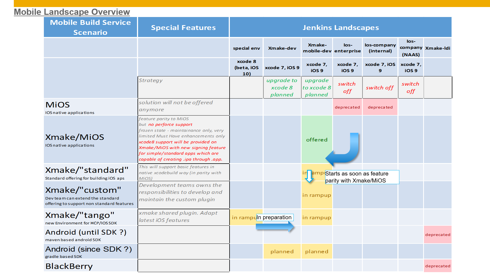
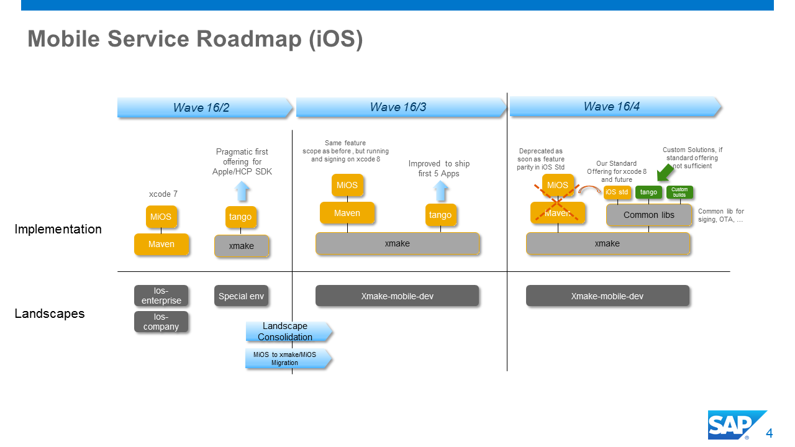

# Mobile Build Services- Change Overview and Roadmap 
:iphone: by  Christopher Jonathan, Ganesh Poojar, Dirk Lüdtke

PI Technology Engineering Services provides standard builds services to build mobile applications for various mobile target platforms. 
This document motivates and summarizes planned mobile build service changes. It is used for alignment with our stakeholder community.

## Problem Space and consequences
###Problem: scenario diversity

Unfortunately, the complexity and diversity of Mobile development scenarios used inside SAP has dramatically increased. 
There are more specific scenarios that require special services solutions to be implemented and supported. 

* iOS 
  * In addition to ObjectiveC apple has introduced the new development technology Swift. New App target platforms (Apple Watch) require support and special enhancements of the process. 
The recently announced partnership between SAP and Apple requires support of xcode 8 features that would require a large refactoring of today’s iOS maven build framework(MiOS Framwork)
* Cordova
  * In addition to native Apps SAP follows a Cordova/Kapsel based development strategy.
* Android 
  * Two different SDKs (maven based and gradle based) need to be supported, that require specific integration into the production landscape 
* BB, Windows Phone
  * Maintenance required for legacy platforms that were used by SAP to ship a small number of Apps, only.

__Consequences__
* It is very difficult to build up detailed domain specific know how centrally for all the various mobile procedures.	
* It is difficult to assure in time maintenance, enhancements of different solutions.
* It is difficult to setup a global mobile build process support as the level of expertise required is too detailed.

## Problem: build landscape diversity
Different build landscapes are required for different technologies and organization units. 
In addition, we maintain separate landscapes for in-house and release builds (NAAS).

__Consequences__

* High non value add work load resulting from landscape configuration tasks, change management, training effort for NAAS colleagues
* More time required to integrate new SDK versions.
* Multiple Landscapes/entry points for Developers 

## Mitigation Strategy
###Foster co-innovation between EngSrv and Mobile Development teams
* All future mobile build solutions with baisc features will provided by Central Team.
* All future mobile build solutions with extended features will be based on custom xmake plugins.
* Custom xmake plugins are developed as „inner source“ projects owned by respective development teams
* Mobile development teams are expected to integrate new basic features, versions in a shared approach
* EngSrv focusses on build landscape management and support

### Landscape consolidation
The following diagram is an overview of currently supported scenarios and landscapes.

* A new Build landscape xmake-mobile-dev has been setup 
* xmake-mobile-dev supports both, company and enterprise builds for iOS in one landscape (short term). This will reduce landscape support and integration efforts.
* xmake-mobile-dev is planned to support builds for all other mobile build scenarios (long term)

## Current State and Actions
The following diagram shows the ongoing consolidation of the mobile service offering.

The mid-term goal is to move all iOS builds into xmake-mobile-dev.  Therefore, all MiOS builds are moved to xmake/MiOS that is only offered in the xmake-mobile-dev landscape. We plan to migrate 75% of the builds in Wave 16_3. The remaining projects  will be migrated until the end of the year. This migration enforces projects to move from Perforce to GitHub(or Git with exceptions), to simplify the offering and shutdown first Perforce specific tools.

Long-term goal is to use xmake/"standard" for all standard iOS builds. To get there. We follow the following roadmap:

Starting point are the new custom xmake plugins to support processes for the new HCP/iOS SDK. They are currently being prepared in a separate environment that requires xcode 8 (beta). Development is done in a joint co-innvation project with colleagues responsible for the new HCP/iOS SDK.

On top of this custom plugin, our team will add central functionality like signing, over the air deployment etc, & then provide a new standard offering for iOS (xmake/Standard). In addition teams can reuse to create their own custom builds. This might be required if latest SDK features cannot be supported in time by the xmake iOS Std.

As soon as xmake/Standard (iOS) offers all required basic build features in par with xmake/MiOS, xmake/MiOS will be deprecated and new projects are created only in xmake/Standard (iOS).

We have defined the Landscapes, their future, stratergy & proposal to solve the current open issues in a wiki --> https://wiki.wdf.sap.corp/wiki/x/Jpp3bg 

